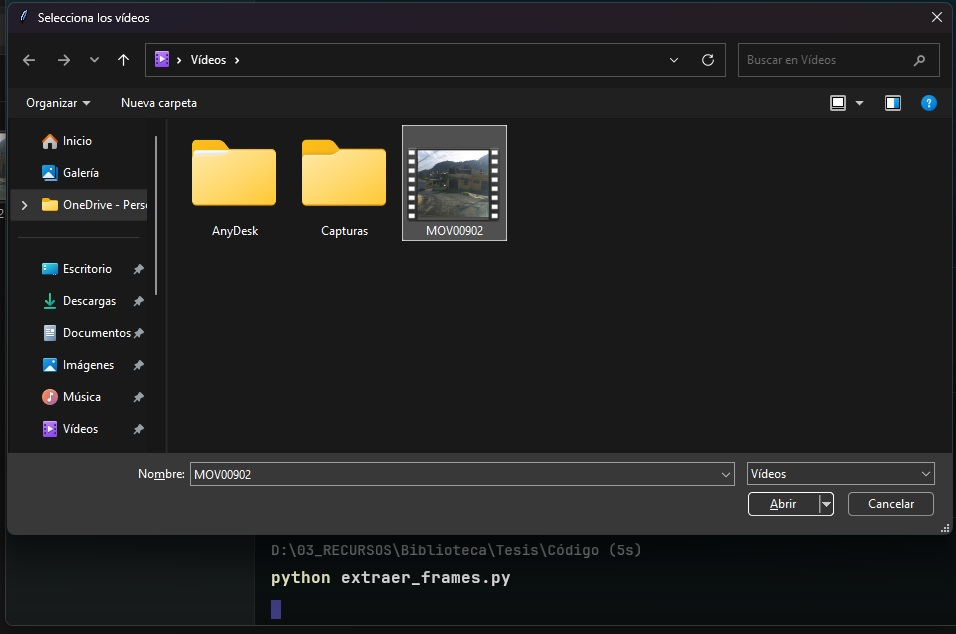
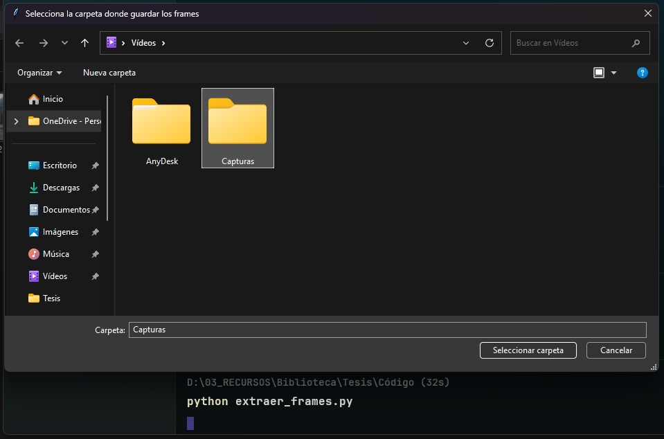
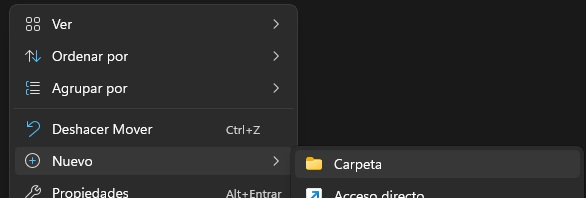
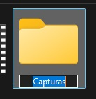
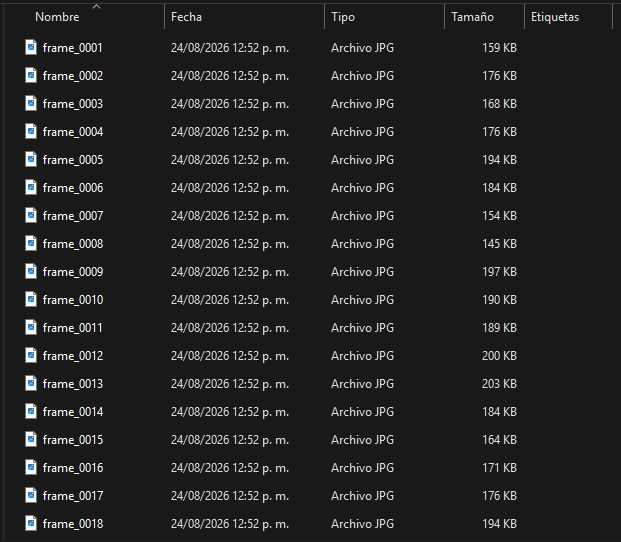
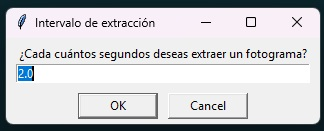
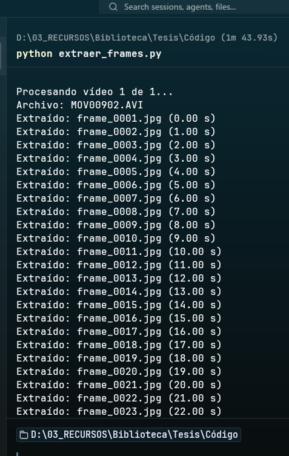
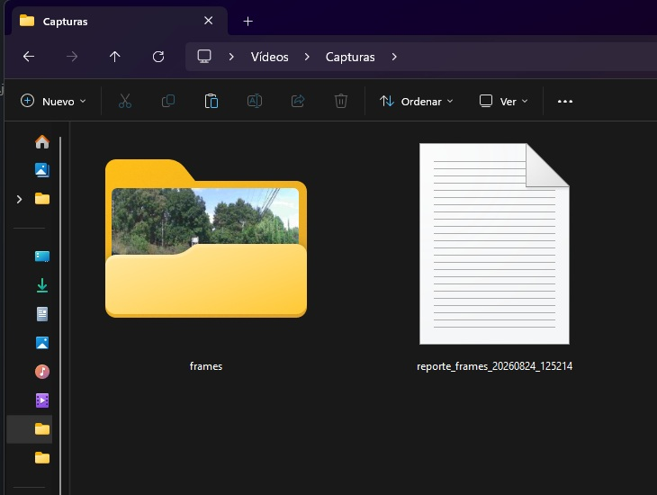
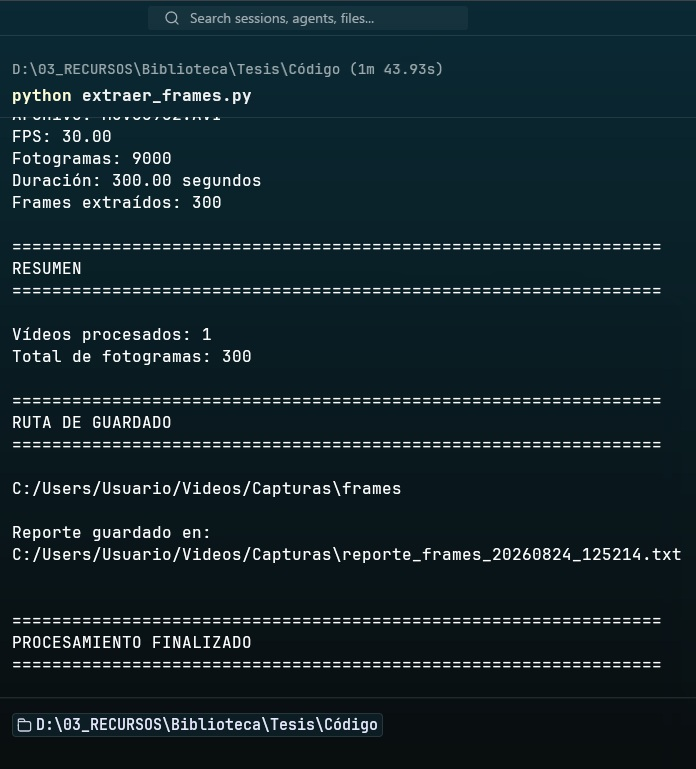

# 🎥 Extractor de Fotogramas de Vídeo

[🇺🇸 English](README.md)

Herramienta desarrollada en Python para extraer fotogramas de uno o varios vídeos en intervalos de tiempo configurables.

Este proyecto fue creado como una **herramienta auxiliar para proyectos de visión artificial**, permitiendo convertir archivos de vídeo en imágenes individuales que posteriormente pueden ser revisadas, seleccionadas, etiquetadas y utilizadas para crear conjuntos de datos (*datasets*) de imágenes.

---

## 🧠 ¿Qué problema resuelve?

Al trabajar en proyectos de visión artificial, los datos suelen recopilarse y almacenarse en formato de vídeo.

Sin embargo, muchas tareas de visión artificial requieren imágenes individuales en lugar de archivos de vídeo completos.

Por ejemplo:

```text
🎥 Vídeo
   │
   ▼
Extractor de Fotogramas de Vídeo
   │
   ▼
🖼️ 🖼️ 🖼️ 🖼️ 🖼️
Fotogramas individuales
```

Esta herramienta automatiza la extracción de imágenes individuales a partir de vídeos utilizando un intervalo de tiempo configurable.

Puede ser útil para preparar datos de imágenes destinados a:

- Detección de objetos.
- Clasificación de imágenes.
- Creación de conjuntos de datos.
- Investigación en visión artificial.
- Proyectos de aprendizaje automático.

> **Nota:** Esta herramienta únicamente extrae y organiza fotogramas de vídeo. No realiza detección de objetos, clasificación de imágenes ni etiquetado automático.

---

## ✨ Características

- Selección de uno o varios vídeos.
- Selección de la carpeta de destino.
- Configuración del intervalo de extracción.
- Intervalo mínimo de extracción de **0.5 segundos**.
- Intervalo predeterminado de **2 segundos**.
- Creación automática de una carpeta `frames`.
- Extracción de fotogramas en formato `.jpg`.
- Numeración consecutiva de los fotogramas durante toda la ejecución.
- Procesamiento de múltiples vídeos en una misma ejecución.
- Obtención de información básica de cada vídeo.
- Generación automática de un reporte de procesamiento en formato `.txt`.
- Visualización de los resultados del procesamiento en la consola.

### Formatos de vídeo compatibles

La interfaz de selección de archivos contempla actualmente los siguientes formatos:

```text
.mp4
.avi
.mov
.mkv
.webm
```

> La compatibilidad real puede depender del códec, la codificación del vídeo y la versión de OpenCV instalada en el sistema.

---

## 📸 ¿Cómo funciona?

### 1. Seleccionar los vídeos

Primero se muestra una ventana de selección de archivos donde se puede elegir uno o varios vídeos.



El programa permite seleccionar varios archivos para procesarlos durante una misma ejecución.

---

### 2. Seleccionar la carpeta de destino

Después de seleccionar los vídeos, el programa solicita la carpeta donde se almacenarán los resultados generados.



Se recomienda utilizar una carpeta independiente para cada sesión de procesamiento. Por ejemplo:

```text
Capturas/
```

Dentro de la ubicación seleccionada, el programa creará automáticamente una carpeta llamada `frames` para almacenar los fotogramas extraídos.

La estructura resultante será similar a:

```text
Capturas/
│
├── frames/
│   ├── frame_0001.jpg
│   ├── frame_0002.jpg
│   ├── frame_0003.jpg
│   └── ...
│
└── reporte_frames_YYYYMMDD_HHMMSS.txt
```







Utilizar una carpeta independiente permite mantener organizados los fotogramas y reportes generados durante cada sesión de procesamiento.

---

### 3. Configurar el intervalo de extracción

A continuación, el programa solicita cada cuántos segundos se desea extraer un fotograma.



El valor predeterminado es:

```text
2.0 segundos
```

El valor mínimo permitido es:

```text
0.5 segundos
```

Por ejemplo:

| Intervalo | Extracción aproximada |
|---:|---|
| `2.0 s` | 1 fotograma cada 2 segundos |
| `1.0 s` | 1 fotograma cada segundo |
| `0.5 s` | 1 fotograma cada medio segundo |

El intervalo debe ser un valor numérico igual o superior a `0.5` segundos.

---

### 4. Extracción de fotogramas

Una vez completada la configuración, el programa comienza a procesar los vídeos seleccionados.

Cada fotograma extraído se guarda en formato `.jpg` dentro de la carpeta `frames`.



Los archivos utilizan una numeración consecutiva:

```text
frame_0001.jpg
frame_0002.jpg
frame_0003.jpg
...
```

La numeración comienza en `0001` y continúa durante toda la ejecución del programa.

---

### 5. Procesamiento de varios vídeos

Es posible procesar varios vídeos durante una misma ejecución.

Cuando se procesan varios archivos, la numeración de los fotogramas continúa de un vídeo al siguiente.

Por ejemplo, si el primer vídeo genera:

```text
frame_0001.jpg
frame_0002.jpg
...
frame_0150.jpg
```

el siguiente vídeo continuará con:

```text
frame_0151.jpg
frame_0152.jpg
...
```

De esta manera, los fotogramas generados durante la misma ejecución mantienen una numeración única y se evita que los archivos de un vídeo sobrescriban los de otro.



---

### 6. Información del procesamiento

Mientras se procesan los vídeos, la consola muestra información sobre la operación actual.


Para cada vídeo, el programa obtiene información como:

- FPS.
- Número total de fotogramas del vídeo.
- Duración.
- Número de fotogramas extraídos.

Esta información permite conocer las características básicas del vídeo y los resultados obtenidos durante la extracción.

---

### 7. Reporte de procesamiento

Una vez finalizado el procesamiento de todos los vídeos seleccionados, el programa genera automáticamente un reporte en formato `.txt` con un resumen de la operación.



El reporte incluye:

- Intervalo de extracción utilizado.
- Nombre del archivo de vídeo.
- FPS.
- Número total de fotogramas del vídeo.
- Duración del vídeo.
- Número de fotogramas extraídos del vídeo.
- Número total de vídeos procesados.
- Número total de fotogramas extraídos.
- Carpeta de destino.

---

## 📂 Estructura de salida

Después del procesamiento, la carpeta seleccionada tendrá una estructura similar a la siguiente:

```text
Carpeta seleccionada/
│
├── frames/
│   ├── frame_0001.jpg
│   ├── frame_0002.jpg
│   ├── frame_0003.jpg
│   ├── frame_0004.jpg
│   ├── ...
│   └── frame_XXXX.jpg
│
└── reporte_frames_YYYYMMDD_HHMMSS.txt
```

Los fotogramas extraídos se almacenan dentro de la carpeta `frames`.

El reporte de procesamiento se guarda directamente en la carpeta de destino seleccionada.

---

## 📊 Reporte de procesamiento

El reporte generado utiliza el siguiente formato para su nombre:

```text
reporte_frames_YYYYMMDD_HHMMSS.txt
```

Por ejemplo:

```text
reporte_frames_20260824_112030.txt
```

Un reporte típico tiene una estructura similar a la siguiente:

```text
=================================================================
                    RESULTADOS DEL PROCESAMIENTO
=================================================================

Intervalo de extracción: 2.00 segundos

-----------------------------------------------------------------
Vídeo 1
-----------------------------------------------------------------

Archivo: ejemplo.mp4
FPS: 60.77
Fotogramas: 18231
Duración: 300.02 segundos
Fotogramas extraídos: 151

=================================================================
RESUMEN
=================================================================

Vídeos procesados: 1
Total de fotogramas extraídos: 151

=================================================================
RUTA DE GUARDADO
=================================================================

C:\Videos\frames
```

En este reporte, **“Fotogramas”** corresponde al número total de fotogramas contenidos en el vídeo original, mientras que **“Fotogramas extraídos”** corresponde al número de imágenes generadas por el programa de acuerdo con el intervalo configurado.

---

## 🧠 Uso en proyectos de visión artificial

Uno de los usos previstos de esta herramienta es la preparación de datos para proyectos de visión artificial.

Por ejemplo, un proyecto de detección de baches en carreteras podría utilizar el siguiente flujo:

```text
🎥 Vídeo de carretera
        │
        ▼
Extractor de Fotogramas de Vídeo
        │
        ▼
🖼️ Fotogramas extraídos
        │
        ▼
🔎 Selección de imágenes
        │
        ▼
🏷️ Etiquetado de imágenes
        │
        ▼
📊 Dataset
        │
        ▼
🤖 Modelo de visión artificial
```

En un proyecto de detección de baches, los fotogramas extraídos pueden revisarse manualmente para identificar imágenes útiles que contengan baches. Posteriormente, estas imágenes pueden etiquetarse e incorporarse a un conjunto de datos para entrenar un modelo de visión artificial.

La herramienta en sí **no realiza la detección de baches ni el etiquetado de imágenes**.

---

## ⚙️ Requisitos

El proyecto fue **probado con Python 3.13.13**.

Se requiere:

- Python 3.13 o una versión compatible.
- OpenCV.
- Tkinter.

### Versión de Python

La versión utilizada durante el desarrollo y las pruebas fue:

```text
Python 3.13.13
```

> La compatibilidad con otras versiones de Python no ha sido probada exhaustivamente y puede depender de las versiones de las librerías instaladas.

---

## 📦 Instalación

### 1. Clonar el repositorio

```bash
git clone https://github.com/TuxidoMask/video_frame_extractor.git
cd video_frame_extractor
```

### 2. Instalar OpenCV

Instala la principal dependencia externa del proyecto:

```bash
pip install opencv-python
```

Tkinter normalmente viene incluido con las instalaciones de Python en Windows.

Dependiendo del sistema operativo y de la distribución de Python utilizada, puede ser necesario instalar Tkinter por separado.

---

## ▶️ Uso

Ejecuta el script de Python desde el directorio del proyecto:

```bash
python script.py
```

> Reemplaza `script.py` por el nombre real del archivo Python si es diferente.

El programa te guiará durante el proceso mediante ventanas gráficas.

---

## 🔢 Numeración de los fotogramas

Los fotogramas se numeran consecutivamente utilizando el siguiente formato:

```text
frame_0001.jpg
frame_0002.jpg
frame_0003.jpg
...
```

La numeración utiliza cuatro dígitos y comienza en `0001`.

Durante una misma ejecución, la numeración continúa entre todos los vídeos seleccionados. Por lo tanto, los fotogramas generados por un vídeo no reutilizan los números asignados a los fotogramas de vídeos anteriores.

---

## ⚠️ Compatibilidad y limitaciones

- El intervalo mínimo de extracción es de `0.5 segundos`.
- Los fotogramas actualmente se guardan únicamente en formato `.jpg`.
- El procesamiento de vídeos depende de OpenCV.
- La compatibilidad real puede variar dependiendo del códec y la codificación del vídeo.
- Que un archivo tenga una extensión compatible no garantiza que pueda abrirse correctamente.
- Los vídeos grandes o de larga duración pueden requerir una cantidad considerable de espacio de almacenamiento.
- La extracción temporal puede no corresponder exactamente con el instante esperado dependiendo de la codificación y estructura del vídeo.
- El proyecto fue probado con Python `3.13.13`, pero no se han realizado pruebas exhaustivas con otras versiones de Python.
- La herramienta está pensada como una utilidad auxiliar y no como un sistema completo de análisis de vídeo.

Si OpenCV no puede abrir uno de los vídeos seleccionados, el programa muestra un mensaje de error y continúa con el siguiente vídeo.

---

## 🔮 Posibles mejoras futuras

Entre las posibles mejoras para futuras versiones se encuentran:

- Mejor compatibilidad con diferentes códecs de vídeo.
- Mejor rendimiento durante la extracción.
- Compatibilidad con formatos de imagen adicionales.
- Configuración de la calidad de las imágenes.
- Reportes de procesamiento más detallados.
- Una interfaz gráfica más completa.
- Opciones adicionales para organizar los fotogramas.
- Inclusión opcional de metadatos asociados a los fotogramas.
- Mejor manejo de errores.

---

## 📁 Estructura del proyecto

Actualmente, el proyecto utiliza una estructura sencilla:

```text
video_frame_extractor/
│
├── assets/
│   └── images/
│       ├── select_video.jpg
│       ├── select_file.jpg
│       ├── select_time_seconds.jpg
│       ├── name_file.jpg
│       ├── new_file.jpg
│       ├── result_frames.jpg
│       ├── finish_file.jpg
│       ├── start_script.jpg
│       └── finish_script.jpg
│
├── script.py
│
├── README.md
├── README.es.md
│
└── ...
```

La carpeta `images` contiene las capturas de pantalla utilizadas en este README.

---

## 📄 Licencia

Este proyecto actualmente no incluye una licencia específica.

Si se desea distribuir o reutilizar el proyecto públicamente, se recomienda agregar una licencia de código abierto adecuada.